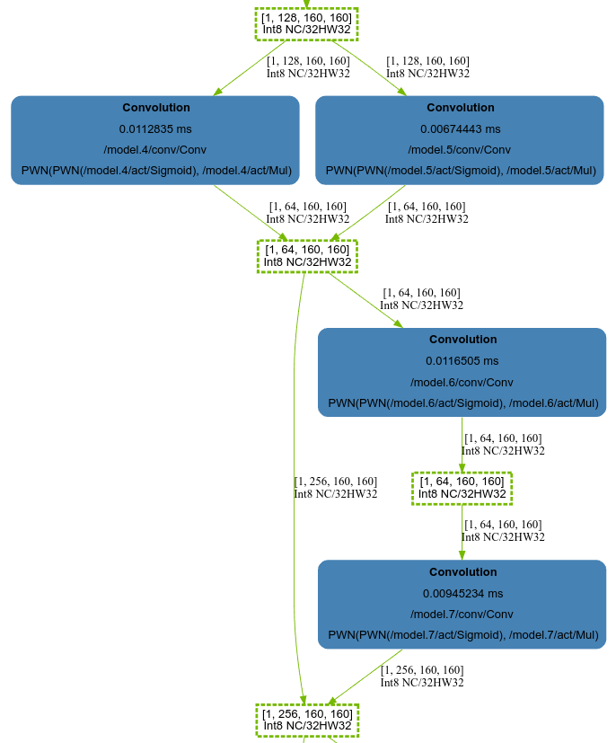
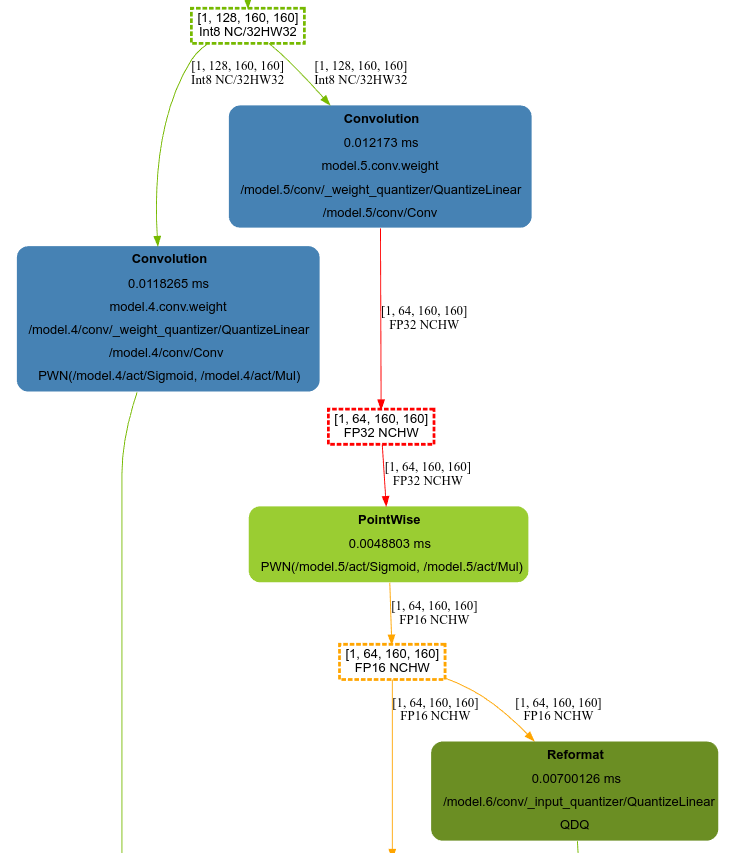
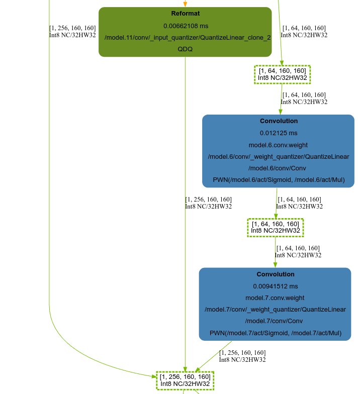

# QAT量化


## Yolov5 QAT 量化

yolov5s 精度性能表现：


|                   |               method                | mAP@0.5:0.95 | fps(bs=1,orin nano) |
| :---------------: | :---------------------------------: | :----------: | :-----------------: |
|   pytorch fp16    |                  -                  |    0.3745    |          -          |
|   pytorch int8    |           Histogram(MSE)            |    0.3711    |          -          |
|   tensorrt fp16   |                  -                  |      -       |         111         |
| tensorrt ptq int8 | TensorRT built in EntropyCalibrator |      -       |         167         |
| tensorrt qat int8 |           Histogram(MSE)            |    0.3718    |         115         |

1	Git clone [yolov5](https://github.com/ultralytics/yolov5) and install Dependencies

```bash
git clone https://github.com/ultralytics/yolov5
cd yolov5
git checkout v7.0
```

2	Copy scripts to yolov5 directory

```bash
cd Linfer/quant-tools
cp -r quantization scripts /path/to/yolov5
```

3	Install dependencies

```bash
pip install pytorch-quantization --extra-index-url https://pypi.ngc.nvidia.com
```

4	Start QAT training

```bash
# 注意修改脚本中的coco数据集路径
python scripts/qat-yolov5.py quantize yolov5s.pt --ptq=ptq.pt --qat=qat.pt --eval-ptq --eval-origin
```

5	Export Onnx

```bash
python scripts/qat-yolov5.py export qat.pt --size=640 --save=qat.onnx --dynamic
```


## Yolov7 QAT 量化

yolov7 精度性能表现：


|                   |               method                | mAP@0.5:0.95 | fps(bs=1,orin nano) |
| :---------------: | :---------------------------------: | :----------: | :-----------------: |
|   pytorch fp16    |                  -                  |    0.5119    |          -          |
|   pytorch int8    |           Histogram(MSE)            |    0.5098    |          -          |
|   tensorrt fp16   |                  -                  |      -       |         39          |
| tensorrt ptq int8 | TensorRT built in EntropyCalibrator |      -       |         60          |
| tensorrt qat int8 |           Histogram(MSE)            |    0.5110    |         59          |

1	Git clone [yolov7](https://github.com/WongKinYiu/yolov7) and install Dependencies

```bash
git clone https://github.com/WongKinYiu/yolov7
cd yolov7
```

2	Copy scripts to yolov7 directory

```bash
cd Linfer/quant-tools
cp -r quantization scripts /path/to/yolov5
```

3	Install dependencies

```bash
pip install pytorch-quantization --extra-index-url https://pypi.ngc.nvidia.com
```

4	Start QAT training

```bash
# 注意修改脚本中的coco数据集路径
python scripts/qat-yolov7.py quantize yolov7.pt --ptq=ptq.pt --qat=qat.pt --eval-ptq --eval-origin
```

5	Export Onnx

```bash
python scripts/qat-yolov7.py export qat.pt --size=640 --save=qat.onnx --dynamic
```


## 优化思路

因为思路都相近，这里仅以yolov7为例，展示图优化前后的差距以及思路。

### 1 前置知识

TensorRT 中有两种量化网络的工作流程，一种是训练后量化（PTQ，ref: [tensorrt-developer-guide/intro-quantization](https://docs.nvidia.com/deeplearning/tensorrt/developer-guide/index.html#intro-quantization)），另一个是量化感知训练（QAT，ref: [tensorrt-developer-guide/work-with-qat-networks](https://docs.nvidia.com/deeplearning/tensorrt/developer-guide/index.html#work-with-qat-networks)）。

- 在PTQ模式下，TensorRT将具有最好的性能，因为它总是选择最好的层融合策略和最快的内核来得到全局最优的网络图。TensorRT 将尽可能多地合并层以在 GPU 上获得最佳性能
- 在QAT模式下，网络图是由用户设计的，这取决于QDQ的放置，网络中的精度转换和层融合策略严格根据QDQ的放置进行选择，会阻碍TensorRT对层的融合。（关于TensorRT的QDQ处理，参考：[TensorRT-developer-guide：Processing of Q/DQ Networks](https://docs.nvidia.com/deeplearning/tensorrt/developer-guide/index.html#tensorrt-process-qdq)）。

也就是说，如果我们想要获得QAT的最佳性能，Q&DQ节点必须确保： 

1. 所有计算密集型层都使用 INT8 运行； 

2. QDQ不能打破QAT模型的层融合；

3. 不要在 INT8 和 FP16 之间进行不必要的数据转换。

获得 QAT 最佳性能的一种有效方法是将 QAT 模型的图与 PTQ 的图进行比较，在正确的位置插入 QDQ，以适应 TensorRT 的融合规则，避免引入无用的精度转换。

> 官方文档中：
>
> - the last convolution will output FP32 precision, even if INT8 is allowed and faster。建议最后一层的conv精度为fp32
> - 因此这就是为什么默认的--ignore-policy为model\.105\.m\.(.*)。 yolov7最后的一个conv为model105.
> - 敏感层分析后，也可以将影响较大的层 添加到 ignore中。
>
> 在QAT中，为了去除reformat节点时，比较关注：concat maxpool add几个节点。
>
> - 如果一个节点的输出，输入到不同的分支节点中，并且分支节点的量化 scale 不同，则 quantize_scale_node 节点无法融合，进而导致了额外的开销。如何解决这个问题？
>
> - 我们使用一个简单的方法，就是强制使所有分支节点的量化 scale 相同（根据经验，在同一数量级上的 scale 可以安全合并），即直接修改 QAT 网络中的 Quantizer 节点的参数。这就是apply_custom_rules_to_quantizer 函数的功能。
>
> - reformat节点比较耗时。
>
> 对于层融合的规则，可以参考：[TensorRT-developer-guide: Types of Fusions](https://docs.nvidia.com/deeplearning/tensorrt/developer-guide/index.html#fusion-types) 。


### 2 开始实践

#### 1 TensorRT benchmark

**fp16：**

```bash
python export.py --weights ./yolov7.pt --grid --simplify --topk-all 100 --iou-thres 0.65 --conf-thres 0.35 --img-size 640 640

trtexec --onnx=yolov7.onnx --fp16 --separateProfileRun --saveEngine=fp16.engine --workspace=1024000 --warmUp=500 --duration=10  --useCudaGraph --useSpinWait --noDataTransfers --exportLayerInfo=fp16_layer.json --profilingVerbosity=detailed --exportProfile=fp16_profile.json

trtexec --loadEngine=fp16.engine --batch=1 --warmUp=500 --duration=10
```

**tensorrt ptq int8：**

```bash
python export.py --weights ./yolov7.pt --grid --simplify --topk-all 100 --iou-thres 0.65 --conf-thres 0.35 --img-size 640 640

trtexec --onnx=yolov7.onnx --fp16 --int8 --separateProfileRun --saveEngine=ptq.engine --workspace=1024000 --warmUp=500 --duration=10  --useCudaGraph --useSpinWait --noDataTransfers --exportLayerInfo=ptq-layer.json --profilingVerbosity=detailed --exportProfile=ptq-profile.json

trtexec --loadEngine=ptq.engine --batch=1 --warmUp=500 --duration=10
```

**tensorrt no-rule qat int8：**

```bash
# 注释掉 quantize.apply_custom_rules_to_quantizer(model, export_onnx)
python scripts/qat.py quantize yolov7.pt --ptq=./no-rule-qat.pt --eval-ptq --eval-origin
python scripts/qat.py export no-rule-qat.pt --size=640 --save=no-rule-qat.onnx --dynamic

trtexec --onnx=no-rule-qat.onnx --fp16 --int8 --separateProfileRun --saveEngine=qat.engine --workspace=1024000 --warmUp=500 --duration=10  --useCudaGraph --useSpinWait --noDataTransfers --exportLayerInfo=no-rule-qat-layer.json --profilingVerbosity=detailed --exportProfile=no-rule-qat-profile.json

trtexec --loadEngine=no-rule-qat.engine --batch=1 --warmUp=500 --duration=10
```

**tensorrt rule qat int8：**

```bash
# 打开注释
python scripts/qat.py quantize yolov7.pt --ptq=./no-rule-qat.pt --eval-ptq --eval-origin
python scripts/qat.py export no-rule-qat.pt --size=640 --save=no-rule-qat.onnx --dynamic

trtexec --onnx=no-rule-qat.onnx --fp16 --int8 --separateProfileRun --saveEngine=qat.engine --workspace=1024000 --warmUp=500 --duration=10  --useCudaGraph --useSpinWait --noDataTransfers --exportLayerInfo=no-rule-qat_layer.json --profilingVerbosity=detailed --exportProfile=no-rule-qat_profile.json

trtexec --loadEngine=no-rule-qat.engine --batch=1 --warmUp=500 --duration=10
```

测试性能如下：

|                  | orin nano(qps) | 4090(qps) |
| :--------------: | :------------: | :-------: |
|     trt_fp16     |     39/37      |  933/844  |
|   trt_ptq_int8   |     60/56      | 1343/1197 |
| no-rule_qat_int8 |     45/41      | 1022/878  |
|  rule_qat_int8   |     59/54      | 1277/1098 |

可以看到 tensorrt 默认 ptq int8 量化性能最快，默认插入 QDQ 节点后，速度下降较为明显，其原因就是插入的 QDQ 节点影响了 tensorrt 的层融合。在修改之后 速度提升明显，虽然比不上ptq，但也快很多。

#### 2 engine 可视化

```bash
python scripts/draw-engine.py --layer=ptq-layer.json --profile=ptq-profile.json
python scripts/draw-engine.py --layer=no-rule-qat-layer.json --profile=no-rule-qat-profile.json
```

看第一个cancat节点，上面为 ptq的，下面为 no-rule-qat 的。








可以看到 ptq 层融合做的很好，**conv+silu** 融合为一个算子，并且没有 **reformat** 这个多余的节点；

no-rule-qat 中 model.5 没有融合，conv+silu 被拆成了 **conv+pointwise** 两个算子，下面还多了两个 **reformat** 节点。

我们要保证 concat 节点输入输出的 scale 值是相同的，可以直接输出 int8，因此可以进行融合，reformat 节点可以去掉。

> 我们的QAT模型中有很多无用的int8->fp16和fp16->int8数据转换。这是因为：TensorRT将强制执行QDQ的规则，以确保在推理和训练过程中保持一致的精度（我们在这里没有看到任何fp32张量，因为TensorRT认为fp16将具有与fp32相同的精度）也就是说：如果我们想要为了减少这些无用的数据格式转换，我们必须编辑 QDQ 节点以适应 TensorRT QAT 的融合规则。从 PTQ 和 QAT 引擎图中，我们可以观察到：TensorRT 中的 concat 层将被减少，并且 concat 的所有输入和输出将合并为一个张量（下图中标记为红色箭头）。如果我们不保证这些张量的 Q&DQ 节点（下图中用绿色圆圈标记）的规模相同。我们的图中将会存在冗余的精度转换。


对于的网络结构，我们需要做同样的限制。有一个特殊的场景我们需要注意：**QDQ 可以跨越某些层**，例如：**MaxPooling、Cancat、Add**。（参考 [TensorRT-developer-guide:tensorrt-process-qdq](https://docs.nvidia.com/deeplearning/tensorrt/developer-guide/index.html#tensorrt-process-qdq)）用红色圆圈标记的 QDQ 节点将穿过 MaxPool 层，TensorRT 会将穿过的 MaxPooling 层标记为 **int8** 精度。现在我们遇到了与 concat 类似的场景：我们应该将 Q&DQ 的规模限制为与绿色圆圈中的 Q&DQ 相同，以避免在这里生成无用的数据格式转换。


#### 3 rule qat

应用 规则 之后可以看到reformat节点减少很多，速度也加快了很多。参考上面的性能测试表格。

yolov7 将下面的这些层的 **_input_quantizer** (scale) 进行匹配：

```bash
Rules: model.6.conv match to model.11.conv
Rules: model.8.conv match to model.11.conv
Rules: model.14.conv match to model.13.conv
Rules: model.19.conv match to model.24.conv
Rules: model.21.conv match to model.24.conv
Rules: model.27.conv match to model.26.conv
Rules: model.32.conv match to model.37.conv
Rules: model.34.conv match to model.37.conv
Rules: model.40.conv match to model.39.conv
Rules: model.45.conv match to model.50.conv
Rules: model.47.conv match to model.50.conv
Rules: model.58.conv match to model.63.conv
Rules: model.59.conv match to model.63.conv
Rules: model.60.conv match to model.63.conv
Rules: model.61.conv match to model.63.conv
Rules: model.70.conv match to model.75.conv
Rules: model.71.conv match to model.75.conv
Rules: model.72.conv match to model.75.conv
Rules: model.73.conv match to model.75.conv
Rules: model.78.conv match to model.77.conv
Rules: model.64.conv match to model.81.conv
Rules: model.83.conv match to model.88.conv
Rules: model.84.conv match to model.88.conv
Rules: model.85.conv match to model.88.conv
Rules: model.86.conv match to model.88.conv
Rules: model.91.conv match to model.90.conv
Rules: model.52.conv match to model.94.conv
Rules: model.96.conv match to model.101.conv
Rules: model.97.conv match to model.101.conv
Rules: model.98.conv match to model.101.conv
Rules: model.99.conv match to model.101.conv
```

#### 4 精度测试


参考：

1. https://github.com/NVIDIA-AI-IOT/yolo_deepstream/tree/main/yolov7_qat
2. https://www.bilibili.com/video/BV18L41197Uz/?share_source=copy_web&vd_source=4bb05d1ac6ff39b7680900de14419dca
3. https://tech.meituan.com/2022/09/22/yolov6-quantization-in-meituan.html
4. https://docs.nvidia.com/deeplearning/tensorrt/developer-guide/index.html#working-with-int8

